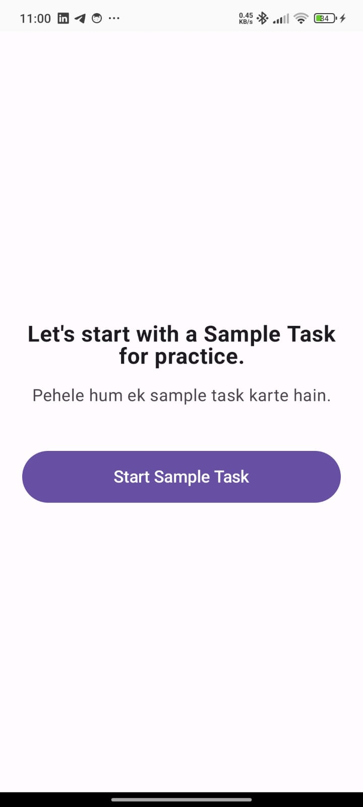
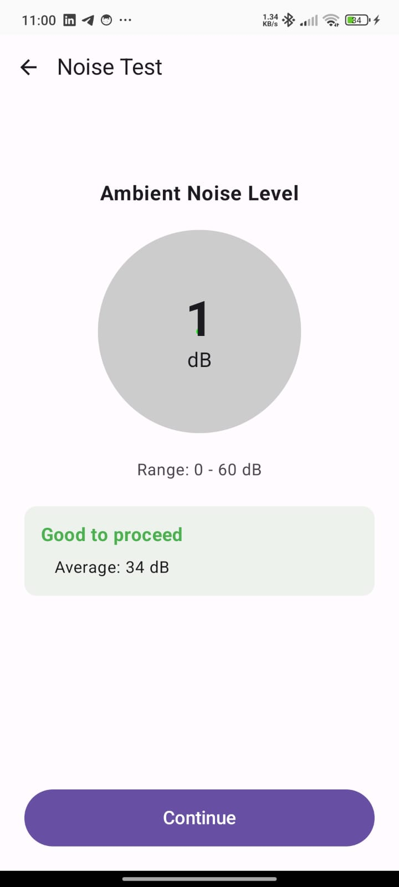
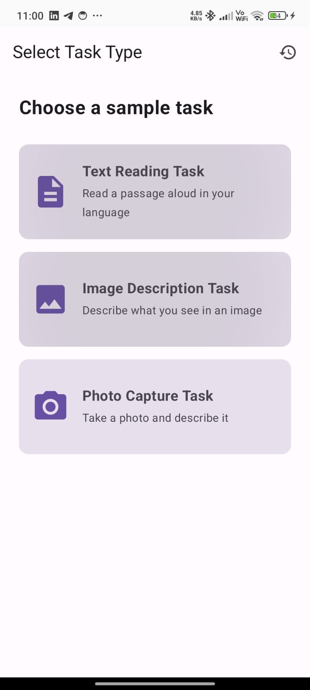
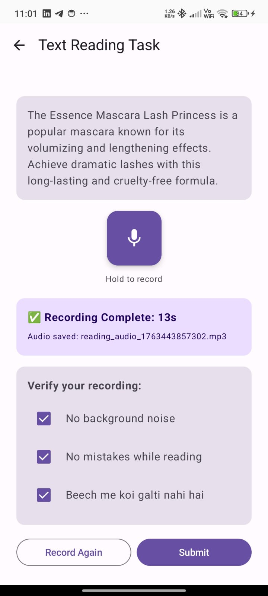
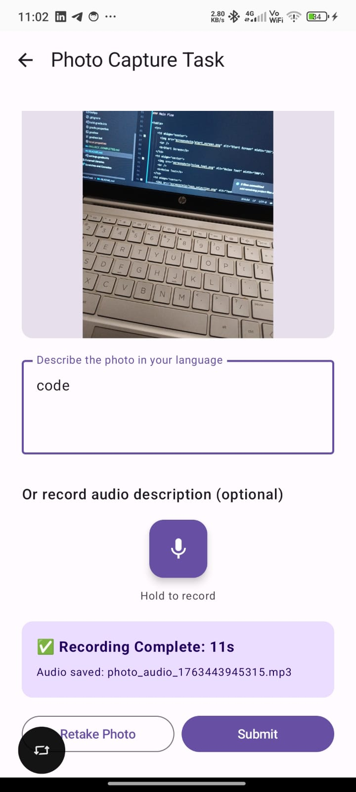
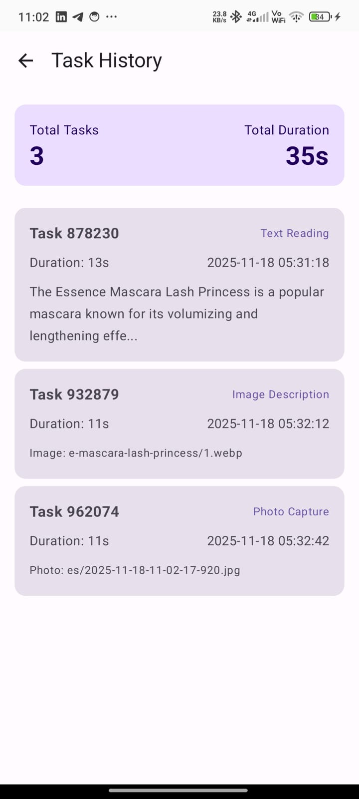

# Android Intern Task - Sample Recording App

A Kotlin Multiplatform (KMM) + Compose Multiplatform (CMP) prototype app that allows users to perform different sample recording tasks (text reading, image description, and photo capture) and view all completed tasks in a local Task History.


## ✨ Features

### Core Functionality

- **Noise Test**: Ambient noise level detection (0-60 dB) before recording
- **Text Reading Task**: Read passages aloud with audio recording (10-20s validation)
- **Image Description Task**: Describe API-fetched images via audio recording
- **Photo Capture Task**: Capture photos and provide text/audio descriptions
- **Task History**: View all completed tasks with details and statistics

### Technical Features

- ✅ Press-and-hold recording mechanism
- ✅ Audio duration validation (10-20 seconds)
- ✅ Runtime permission handling (Camera, Microphone)
- ✅ API integration with DummyJSON Products API
- ✅ Local task storage with metadata
- ✅ Real-time recording feedback with progress indicators
- ✅ Bilingual UI (English + Hindi)

## 🛠 Tech Stack

- **Language**: Kotlin
- **Framework**: Kotlin Multiplatform (KMM)
- **UI**: Compose Multiplatform (CMP) with Material 3
- **Networking**: Ktor Client
- **Serialization**: kotlinx.serialization
- **Image Loading**: Coil
- **Camera**: CameraX
- **Audio Recording**: MediaRecorder
- **Date/Time**: kotlinx-datetime

## 🏗 Architecture

The app follows a clean architecture pattern with:

- **Data Layer**: Repository pattern with API integration
- **Domain Layer**: Data models and business logic
- **Presentation Layer**: Compose UI screens with state management
- **Utils**: Helper classes for permissions, audio, and camera operations

```
com.example.androidinterntask/
├── data/
│   └── TaskRepository.kt
├── models/
│   └── Task.kt
├── screens/
│   ├── StartScreen.kt
│   ├── NoiseTestScreen.kt
│   ├── TaskSelectionScreen.kt
│   ├── TextReadingTaskScreen.kt
│   ├── ImageDescriptionTaskScreen.kt
│   ├── PhotoCaptureTaskScreen.kt
│   └── TaskHistoryScreen.kt
├── utils/
│   ├── PermissionHandler.kt
│   ├── AudioRecorderHelper.kt
│   └── CameraHelper.kt
└── App.kt
```

## 📸 Screenshots

### Main Flow

<table>
  <tr>
    <td align="center">
      
      <br />
      <b>Start Screen</b>
    </td>
    <td align="center">
      
      <br />
      <b>Noise Test</b>
    </td>
    <td align="center">
      
      <br />
      <b>Task Selection</b>
    </td>
  </tr>
</table>

### Task Screens

<table>
  <tr>
    <td align="center">
      
      <br />
      <b>Text Reading Task</b>
    </td>
    <td align="center">
      
      <br />
      <b>Image Description</b>
    </td>
    <td align="center">
      
      <br />
      <b>Photo Capture</b>
    </td>
  </tr>
</table>

### Recording & History

<table>
  <tr>
    <td align="center">
      
      <br />
      <b>Task History</b>
    </td>
  </tr>
</table>


## 🚀 Setup Instructions

### Prerequisites

- Android Studio Hedgehog (2023.1.1) or newer
- JDK 17 or higher
- Android SDK with minimum API level 24
- Kotlin 1.9.0 or higher

### Installation

1. **Clone the repository**
   ```bash
   git clone https://github.com/pratish444/Task-KMP-CMP
   cd android-intern-task
   ```

2. **Open in Android Studio**
    - Open Android Studio
    - Select "Open an Existing Project"
    - Navigate to the cloned directory

3. **Sync Gradle**
    - Wait for Gradle sync to complete
    - Resolve any dependency issues if prompted

4. **Run the app**
    - Connect an Android device or start an emulator
    - Click Run (Shift + F10) or the green play button
    - Grant required permissions when prompted

### Required Permissions

The app requires the following permissions:

- **RECORD_AUDIO**: For audio recording in all task types
- **CAMERA**: For photo capture task
- **INTERNET**: For fetching product data from API

These are automatically requested at runtime when needed.

## 📁 Project Structure

```
androidApp/
├── src/main/
│   ├── java/com/example/androidinterntask/
│   │   ├── data/
│   │   │   └── TaskRepository.kt          # API calls & local storage
│   │   ├── models/
│   │   │   └── Task.kt                    # Data models
│   │   ├── screens/
│   │   │   ├── StartScreen.kt             # Entry point
│   │   │   ├── NoiseTestScreen.kt         # Noise level check
│   │   │   ├── TaskSelectionScreen.kt     # Task type selector
│   │   │   ├── TextReadingTaskScreen.kt   # Text reading with audio
│   │   │   ├── ImageDescriptionTaskScreen.kt  # Image + audio
│   │   │   ├── PhotoCaptureTaskScreen.kt  # Camera + audio
│   │   │   └── TaskHistoryScreen.kt       # Completed tasks
│   │   ├── utils/
│   │   │   ├── PermissionHandler.kt       # Runtime permissions
│   │   │   ├── AudioRecorderHelper.kt     # Audio recording
│   │   │   └── CameraHelper.kt            # Camera operations
│   │   ├── App.kt                         # Navigation logic
│   │   └── MainActivity.kt                # App entry point
│   └── AndroidManifest.xml                # App configuration
```

## 🌐 API Integration

The app uses the **DummyJSON Products API** for fetching sample content:

**Endpoint**: `https://dummyjson.com/products`

**Usage**:
- **Text Reading Task**: Fetches product description as reading passage
- **Image Description Task**: Displays product images for description

**Implementation**:
```kotlin
suspend fun fetchProduct(): Product? {
    return try {
        val response: ProductsResponse = client.get("https://dummyjson.com/products").body()
        response.products.firstOrNull()
    } catch (e: Exception) {
        null
    }
}
```

## 🔐 Permissions

### Microphone Permission (RECORD_AUDIO)
- **When**: Automatically requested before first recording
- **Why**: Required for audio recording in all task types
- **Fallback**: Shows permission dialog if denied

### Camera Permission (CAMERA)
- **When**: Requested when "Open Camera" is clicked
- **Why**: Required for photo capture task
- **Fallback**: Shows permission dialog with explanation

### Internet Permission
- Granted automatically (normal permission)
- Required for API calls

## 📱 Task Flow

### 1. Start Screen
- Entry point with bilingual instructions
- Button navigates to Noise Test

### 2. Noise Test Screen
- Simulates decibel meter (0-60 dB)
- Tests for 3 seconds
- Pass threshold: < 40 dB average
- Fail: Shows "Move to quieter place"

### 3. Task Selection
Three options:
- **Text Reading**: Read passage aloud
- **Image Description**: Describe API image
- **Photo Capture**: Take photo + describe

### 4. Task Execution
Each task follows:
1. Display content (text/image/camera)
2. Press-and-hold mic button to record
3. Validate duration (10-20 seconds)
4. Review recording
5. Submit to local storage

### 5. Task History
- View all completed tasks
- Shows total tasks and duration
- Displays task details with previews

## 🎯 Key Features Implementation

### Press-and-Hold Recording
```kotlin
val interactionSource = remember { MutableInteractionSource() }

LaunchedEffect(interactionSource) {
    interactionSource.interactions.collect { interaction ->
        when (interaction) {
            is PressInteraction.Press -> startRecording()
            is PressInteraction.Release -> stopRecording()
            is PressInteraction.Cancel -> cancelRecording()
        }
    }
}
```

### Duration Validation
- **Minimum**: 10 seconds
- **Maximum**: 20 seconds
- **Feedback**: Real-time progress bar and inline error messages

### Local Storage
Tasks are stored in-memory with:
- Unique task ID
- Task type enum
- Timestamp (ISO 8601)
- Duration in seconds
- Content (text/image/audio paths)

## 📊 Task Data Structure

```kotlin
data class Task(
    val id: String,
    val taskType: TaskType,
    val timestamp: String,
    val durationSec: Int,
    val text: String? = null,
    val imageUrl: String? = null,
    val imagePath: String? = null,
    val audioPath: String? = null,
    val textDescription: String? = null
)

enum class TaskType {
    TEXT_READING,
    IMAGE_DESCRIPTION,
    PHOTO_CAPTURE
}
```


## 🙏 Acknowledgments

- DummyJSON for providing the free API
- Jetpack Compose team for the modern UI toolkit
- Android developer community

---
